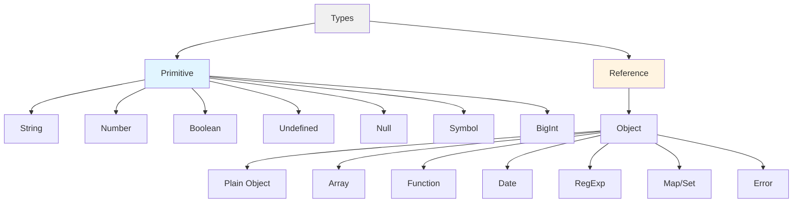

## Overview

JavaScript has two main categories of data types:



### Key Differences

| Aspect | Primitive Types | Reference Types |
|--------|----------------|-----------------|
| **Storage** | Stored directly in the variable | Variable stores a reference to memory location |
| **Mutability** | Immutable | Mutable |
| **Comparison** | Compared by value | Compared by reference |
| **Copy Behavior** | Creates independent copy | Creates reference to same object |


```js
// Primitive - Copy by value
let a = 5
let b = a
b = 10
console.log(a) // 5 (unchanged)

// Reference - Copy by reference
let obj1 = { value: 5 }
let obj2 = obj1
obj2.value = 10
console.log(obj1.value) // 10 (changed!)
```

---

## Primitive Types

JavaScript has 7 primitive data types:

### 1. String

Represents textual data.

```js
let name = 'Alice'
let greeting = "Hello"
let template = `Welcome ${name}`

typeof name // "string"
```

### 2. Number

Represents both integer and floating-point numbers.

```js
let age = 25
let price = 19.99
let negative = -10
let infinity = Infinity
let notANumber = NaN

typeof age // "number"
typeof NaN // "number"
typeof Infinity // "number"
```

### 3. Boolean

Represents logical values: `true` or `false`.

```js
let isActive = true
let hasPermission = false

typeof isActive // "boolean"
```

### 4. Undefined

Represents a variable that has been declared but not assigned a value.

```js
let x
let y = undefined

typeof x // "undefined"
typeof doesntExist // "undefined"
```

### 5. Null

Represents the intentional absence of any value.

```js
let user = null

typeof null // "object" (historical bug in JavaScript)
```

> **Note:** `typeof null` returns `"object"` due to a legacy bug in JavaScript that cannot be fixed for backwards compatibility reasons.

### 6. Symbol

Represents a unique identifier (ES6+).

```js
let id1 = Symbol('id')
let id2 = Symbol('id')

id1 === id2 // false (each Symbol is unique)
typeof id1 // "symbol"
```

### 7. BigInt

Represents integers larger than `Number.MAX_SAFE_INTEGER` (ES2020+).

```js
let bigNumber = 1234567890123456789012345678901234567890n
let anotherBig = BigInt("9007199254740991")

typeof bigNumber // "bigint"
```

---

## The typeof Operator

The `typeof` operator returns a string indicating the type of a value.

### Basic Usage

```js
typeof 42                   // "number"
typeof 'hello'              // "string"
typeof true                 // "boolean"
typeof undefined            // "undefined"
typeof Symbol('foo')        // "symbol"
typeof 123n                 // "bigint"
```

### typeof with Objects

```js
let myFun = new Function('5 + 2')
let shape = 'round'
let size = 1
let foo = ['Apple', 'Mango', 'Orange']
let today = new Date()

typeof myFun       // "function"
typeof shape       // "string"
typeof size        // "number"
typeof foo         // "object"
typeof today       // "object"
typeof null        // "object"
```

### Primitive vs Object Wrappers

```js
// Primitive string
typeof 'Hello world'              // "string"
typeof String('Hello world')      // "string"

// String object wrapper
typeof new String('Hello world')  // "object"

// Same pattern for other primitives
typeof 42                         // "number"
typeof new Number(42)             // "object"

typeof true                       // "boolean"
typeof new Boolean(true)          // "object"
```

> **Best Practice:** Use primitive values instead of wrapper objects. Wrapper objects can cause unexpected behavior.

---

## Object Types

Everything in JavaScript that isn't a primitive is an object (or derives from Object).

### Common Object Types

```js
// Plain Object
let person = { name: 'John', age: 30 }
typeof person // "object"

// Array
let colors = ['red', 'green', 'blue']
typeof colors // "object"

// Date
let now = new Date()
typeof now // "object"

// Regular Expression
let pattern = /ab+c/
typeof pattern // "object"

// Function (special case)
function greet() { return 'Hello' }
typeof greet // "function"

// Null (quirk)
typeof null // "object"
```

---

## Type Checking

### Using typeof

Good for checking primitive types:

```js
typeof value === 'string'
typeof value === 'number'
typeof value === 'boolean'
typeof value === 'undefined'
typeof value === 'function'
```

### Using instanceof

The `instanceof` operator checks if an object is an instance of a specific constructor.

```js
let arr = [1, 2, 3]
let date = new Date()
let regex = /test/

arr instanceof Array        // true
date instanceof Date        // true
regex instanceof RegExp     // true

arr instanceof Object       // true (Array inherits from Object)
'hello' instanceof String   // false (primitives are not instances)
```

### Array Checking

```js
let arr = [1, 2, 3]

// Best method
Array.isArray(arr)          // true

// Alternative (less reliable)
arr instanceof Array        // true

// Not recommended
typeof arr                  // "object" (not specific enough)
```

### Null Checking

```js
let value = null

// Correct way to check for null
value === null              // true

// Don't use typeof alone
typeof value                // "object" (misleading)

// Check for null or undefined
value == null               // true (loose equality)
value === null || value === undefined  // explicit check
```

---

## Object.is() for Value Comparison

`Object.is()` provides a more precise equality check than `===`, especially for special values.

### Comparison with ===

For most values, `Object.is()` behaves the same as `===`:

```js
// Case 1: Evaluation result is the same as using ===
Object.is(25, 25)                // true
Object.is('foo', 'foo')          // true
Object.is('foo', 'bar')          // false
Object.is(null, null)            // true
Object.is(undefined, undefined)  // true
Object.is(window, window)        // true
Object.is([], [])                // false

let foo = { a: 1 }
let bar = { a: 1 }
Object.is(foo, foo)              // true
Object.is(foo, bar)              // false
```

### Special Case: Signed Zero

`Object.is()` distinguishes between `+0` and `-0`, while `===` treats them as equal:

```js
// Case 2: Signed zero
Object.is(0, -0)                 // false
Object.is(+0, -0)                // false
Object.is(-0, -0)                // true
Object.is(0n, -0n)               // true

// Compare with ===
0 === -0                         // true
+0 === -0                        // true
```

### Special Case: NaN

`Object.is()` correctly identifies `NaN` as equal to itself, while `===` does not:

```js
// Case 3: NaN
Object.is(NaN, 0 / 0)            // true
Object.is(NaN, Number.NaN)       // true

// Compare with ===
NaN === NaN                      // false
NaN === Number.NaN               // false

// Use Number.isNaN() for NaN checks
Number.isNaN(NaN)                // true
```

### When to Use Object.is()

```js
// Use Object.is() when you need to distinguish:

// 1. Positive and negative zero
function safeDivide(a, b) {
  if (Object.is(b, -0)) {
    return -Infinity
  }
  return a / b
}

// 2. NaN values
function isActuallyNaN(value) {
  return Object.is(value, NaN)
}

// 3. Use === for everything else (it's faster)
value === 42
value === 'hello'
```

---

## Type Coercion

JavaScript automatically converts types in certain situations.

### Implicit Coercion

```js
// String coercion
'5' + 2                     // "52" (number to string)
'5' + true                  // "5true"

// Number coercion
'5' - 2                     // 3 (string to number)
'5' * '2'                   // 10
true + true                 // 2

// Boolean coercion
if ('hello') { }            // truthy
if (0) { }                  // falsy
```

### Explicit Coercion

```js
// To String
String(123)                 // "123"
(123).toString()            // "123"

// To Number
Number('123')               // 123
parseInt('123px')           // 123
parseFloat('12.34')         // 12.34
+'123'                      // 123 (unary plus)

// To Boolean
Boolean(1)                  // true
Boolean(0)                  // false
!!value                     // converts to boolean
```

### Falsy Values

These values coerce to `false`:

```js
Boolean(false)              // false
Boolean(0)                  // false
Boolean(-0)                 // false
Boolean(0n)                 // false
Boolean('')                 // false
Boolean(null)               // false
Boolean(undefined)          // false
Boolean(NaN)                // false
```

All other values are truthy.

---

## Special Type Behaviors

### Primitive Immutability

Primitives are immutable - their values cannot be changed:

```js
let str = 'hello'
str[0] = 'H'  // No effect
console.log(str)  // 'hello'

// String methods return new strings
let upper = str.toUpperCase()  // Creates new string
console.log(str)    // 'hello' (original unchanged)
console.log(upper)  // 'HELLO' (new string)
```

### Primitive Auto-boxing

JavaScript automatically wraps primitives in objects when accessing properties:

```js
let str = 'hello'
console.log(str.length)        // 5
console.log(str.toUpperCase()) // 'HELLO'

// Behind the scenes:
// temp = new String('hello')
// temp.length
// temp is discarded

// You can't add properties to primitives
str.customProperty = 'value'
console.log(str.customProperty) // undefined
```

### Number Precision Issues

JavaScript uses IEEE 754 floating-point arithmetic:

```js
0.1 + 0.2                      // 0.30000000000000004
0.1 + 0.2 === 0.3              // false

// Solution: Use epsilon comparison
Math.abs((0.1 + 0.2) - 0.3) < Number.EPSILON  // true

// Or work with integers
(1 + 2) / 10 === 0.3           // true

// Safe integer range
Number.MAX_SAFE_INTEGER        // 9007199254740991
Number.MIN_SAFE_INTEGER        // -9007199254740991

// For larger integers, use BigInt
const big = 9007199254740991n + 1n  // 9007199254740992n
```

### Void Operator

The `void` operator evaluates an expression and returns `undefined`:

```js
void 0                         // undefined
void(0)                        // undefined
void 2 + 2                     // NaN (void has higher precedence)
void (2 + 2)                   // undefined

// Common use: ensuring undefined
let value = void 0             // guaranteed undefined

// In links to prevent navigation
<a href="javascript:void(0)">Click</a>
```

### Dynamic Typing

Variables can change types:

```js
let value = 42                 // number
value = 'hello'                // now string
value = true                   // now boolean
value = { name: 'John' }       // now object

// This flexibility can lead to bugs
function add(a, b) {
  return a + b
}

add(5, 10)                     // 15
add('5', 10)                   // "510" (oops!)
```

### Type Conversion Edge Cases

```js
// Empty array to number
+[]                            // 0
+[5]                           // 5
+[1, 2]                        // NaN

// Boolean to number
+true                          // 1
+false                         // 0

// String to number
+'42'                          // 42
+'   42   '                    // 42 (whitespace trimmed)
+'42px'                        // NaN
parseInt('42px')               // 42 (stops at non-digit)

// Object to primitive
({}).toString()                // "[object Object]"
[1, 2, 3].toString()          // "1,2,3"

// Addition vs concatenation
1 + 2 + '3'                    // "33"
'1' + 2 + 3                    // "123"
```

### Symbol Uniqueness

Symbols are always unique, even with the same description:

```js
let sym1 = Symbol('id')
let sym2 = Symbol('id')
sym1 === sym2                  // false

// Global symbol registry
let globalSym1 = Symbol.for('id')
let globalSym2 = Symbol.for('id')
globalSym1 === globalSym2      // true

// Use case: Object property keys
const ID = Symbol('id')
let user = {
  name: 'John',
  [ID]: 12345
}

Object.keys(user)              // ['name'] (Symbol not enumerated)
user[ID]                       // 12345
```

### WeakMap and WeakSet

Special collections that don't prevent garbage collection:

```js
// WeakMap - keys must be objects
let weakMap = new WeakMap()
let obj = { data: 'value' }

weakMap.set(obj, 'metadata')
console.log(weakMap.get(obj))  // 'metadata'

obj = null  // Object can be garbage collected

// WeakSet - values must be objects
let weakSet = new WeakSet()
let element = { id: 1 }

weakSet.add(element)
weakSet.has(element)           // true

element = null  // Can be garbage collected
```

### Proxy and Reflect

Meta-programming with objects:

```js
// Proxy - intercept object operations
let target = { value: 42 }
let proxy = new Proxy(target, {
  get(target, property) {
    console.log(`Reading ${property}`)
    return target[property]
  },
  set(target, property, value) {
    console.log(`Writing ${property} = ${value}`)
    target[property] = value
    return true
  }
})

proxy.value        // Logs: "Reading value", returns 42
proxy.value = 100  // Logs: "Writing value = 100"

// Reflect - perform operations programmatically
Reflect.has(target, 'value')              // true
Reflect.get(target, 'value')              // 100
Reflect.set(target, 'value', 200)         // true
Reflect.deleteProperty(target, 'value')   // true
```

### JSON Limitations

Not all types can be serialized to JSON:

```js
// Types that JSON.stringify handles
JSON.stringify({
  string: 'hello',
  number: 42,
  boolean: true,
  null: null,
  array: [1, 2, 3],
  object: { nested: true }
})

// Types that become null or undefined
JSON.stringify({
  fn: function() {},          // undefined (omitted)
  undef: undefined,           // undefined (omitted)
  sym: Symbol('id'),          // undefined (omitted)
  bigint: 123n               // Error: BigInt not supported
})

// Special values
JSON.stringify(NaN)          // "null"
JSON.stringify(Infinity)     // "null"
JSON.stringify(-Infinity)    // "null"

// Dates become strings
JSON.stringify(new Date())   // "2024-01-15T12:00:00.000Z"
```

---

## Best Practices

### 1. Use Strict Equality

```js
// Recommended
value === 42
value !== null

// Avoid (loose equality)
value == 42
value != null
```

### 2. Use Primitives Over Wrappers

```js
// Good
let str = 'hello'
let num = 42
let bool = true

// Avoid
let str = new String('hello')
let num = new Number(42)
let bool = new Boolean(true)
```

### 4. Handle null and undefined

```js
// Check for both null and undefined
if (value == null) {
  // handles both null and undefined
}

// Or be explicit
if (value === null || value === undefined) {
  // ...
}

// Optional chaining (ES2020+)
const name = user?.profile?.name

// Nullish coalescing (ES2020+)
const count = value ?? 0  // only replaces null/undefined
```

### 5. Validate Array Types

```js
// Always use Array.isArray
if (Array.isArray(value)) {
  value.forEach(item => console.log(item))
}
```

---

## Common Pitfalls

```js
// 1. typeof null
typeof null === 'object'    // true (historical bug)

// 2. typeof array
typeof [] === 'object'      // true (use Array.isArray)

// 3. NaN
typeof NaN === 'number'     // true (NaN is a number type)
NaN === NaN                 // false (use Number.isNaN)

// 4. Wrapper objects
typeof new String('x')      // "object", not "string"

// 5. Functions
typeof function() {}        // "function", not "object"
```

---
